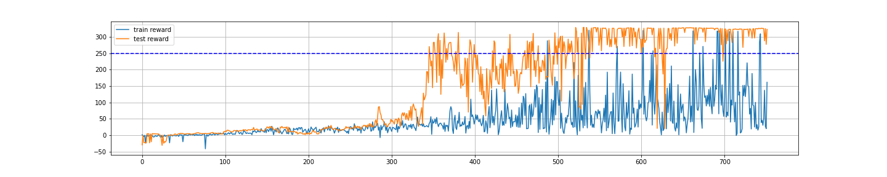
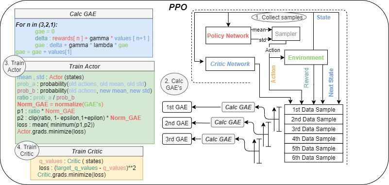
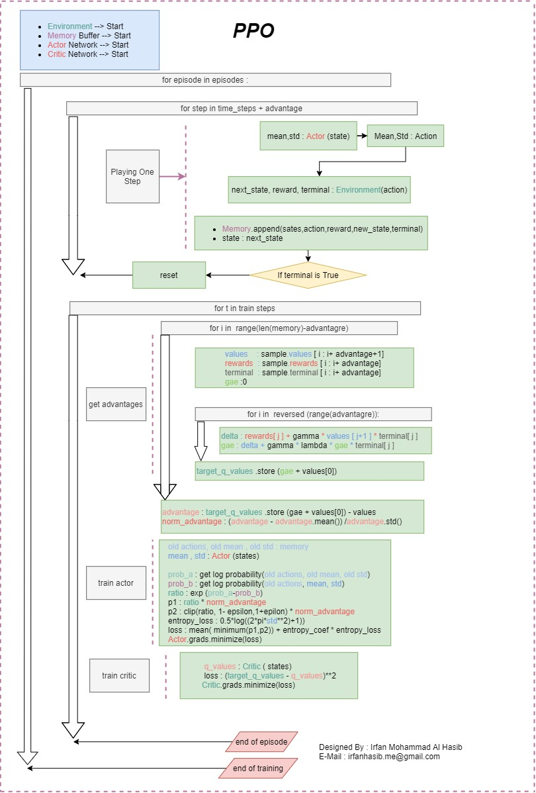

<div>
    <h2> Sections </h2>
<ul id="ul_1">
    <b><I>
    <li>Section 1: Overview </li>
    <li>Section 2. Result</li>
    <li>Section 3. Code</li>
    <li>Section 4: Usage </li>
    <li>Section 5. Flowchart</li>
    </b></I>
</ul>
</div>

<div> 
<h3> 1.  Overview </h3>

  PPO implemented and tested on OpenAI gym Bipedal Walker Environment.The algorithm is implemnted from scratch using TensorFlow, Numpy and Python.
This is an implementation of the following paper by <a href="https://openai.com/">OpenAI</a><br>
<b><i>Proximal Policy Optimization Algorithms</b></i> <a href="https://arxiv.org/abs/1707.06347">arxiv link</a><br><br>
Implemented by : Irfan Mohammad Al Hasib <br>
E-Mail : irfanhasib.me@gmail.com <br>
Website : <a href="https://irfanhasib0.github.io">https://irfanhasib0.github.io</a><br>
LinkedIN : <a href="https://www.linkedin.com/in/irfanhasib/">https://www.linkedin.com/in/irfanhasib/</a><br>

</div>

<div>
<h3> 2. Results </h3>

Results PPO on Bipedal Walker
         



</br>
    
</div>

<div>
<h3> 3. Codes </h3>
<ul>
<li><a style="color:navyblue;font-size:15px;" href= https://github.com/irfanhasib0/RL-Algorithms/blob/master/PPO_Cleaned_Code/5.1_PPO_Bipedal_Walker-revised-clr.ipynb> <b>  PPO for Bipedal Walker - Notebook (Cleaned and Organized code)</b> </a></li>

<li><a style="color:navyblue;font-size:15px;" href= https://github.com/irfanhasib0/RL-Algorithms/blob/master/5.2_PPO_Lunar_Lander.ipynb> <b>  PPO for Lunar Lander - Notebook (Raw Code)</b> </a></li>
</ul>
</div>

<div>
<h3> 4. Usage </h3>
The code is tested with package versions -
<ul>
    <li> <b>Python-3.7.7 </li>
    <li> tensorflow-2.3.0 </li>
    <li> numpy-1.18.1 </li> 
    <li> opencv-4.5.2  </li>
    <li> gym-0.14.0 </li>
    <li> matplotlib-3.2.1<b/></li>
</ul>
</div>

<div>
<h3> 5. Detailed Flow Chart for DQN and DDPG : (Please Zoom or Open in New tab for proper resolution) </h3>

    



     
</div>

<div>
<h3>  Links for other implementations : </h3>
<ul>
<li><a style="color:navyblue;font-size:15px;" href= https://github.com/irfanhasib0/RL-Algorithms/blob/master/1.0_Multi_Arm_Bandit.ipynb>  Multi Arm Bandit - Notebook </a></li>
<li><a style="color:navyblue;font-size:15px;" href= https://github.com/irfanhasib0/RL-Algorithms/blob/master/2.1_Value_Iteration.ipynb>   Value Iteration - Notebook  </a></li>
<li><a style="color:navyblue;font-size:15px;" href= https://github.com/irfanhasib0/RL-Algorithms/blob/master/3.0_DQN_Mountain_Car.ipynb>  DQN for Mountain Car - Notebook  </a></li>
<li><a style="color:navyblue;font-size:15px;" href= https://github.com/irfanhasib0/RL-Algorithms/blob/master/4.0_DDPG_Pendulum-mod.ipynb> DDPG for Pendulum - Notebook</a></li>
<li><a style="color:navyblue;font-size:15px;" href= https://github.com/irfanhasib0/RL-Algorithms/blob/master/5.1_PPO_Bipedal_Walker-revised-clr.ipynb>  PPO for Bipedal Walker - Notebook</a></li>
<li><a style="color:navyblue;font-size:15px;" href= https://github.com/irfanhasib0/RL-Algorithms/blob/master/5.2_PPO_Lunar_Lander.ipynb>  PPO for Lunar Lander - Notebook </a></li>
</ul>
</div>


```python

```
